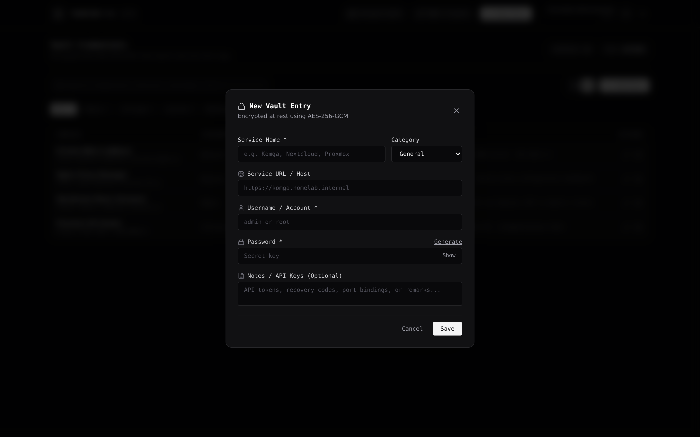
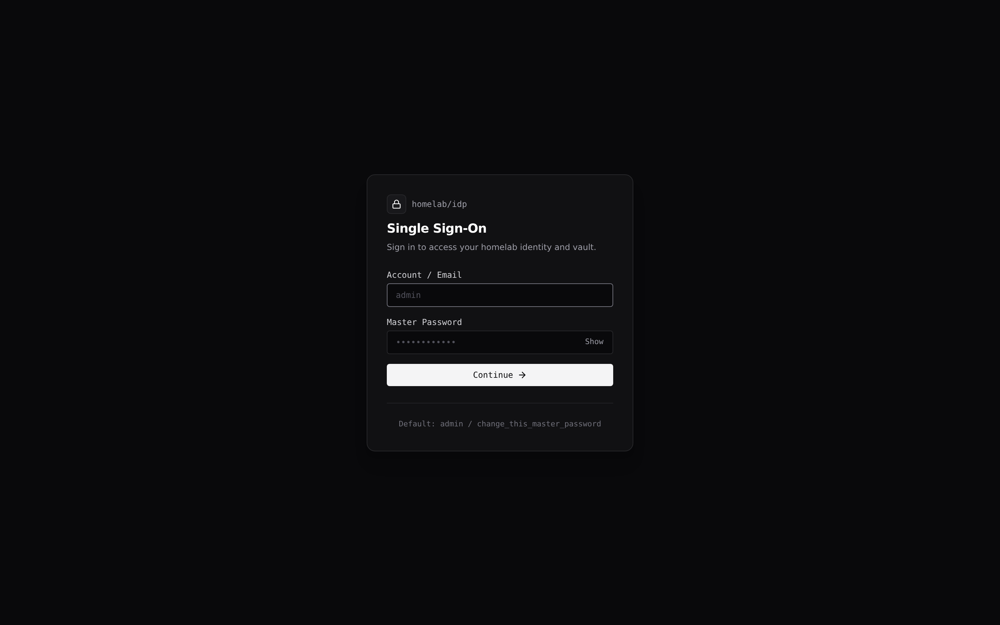
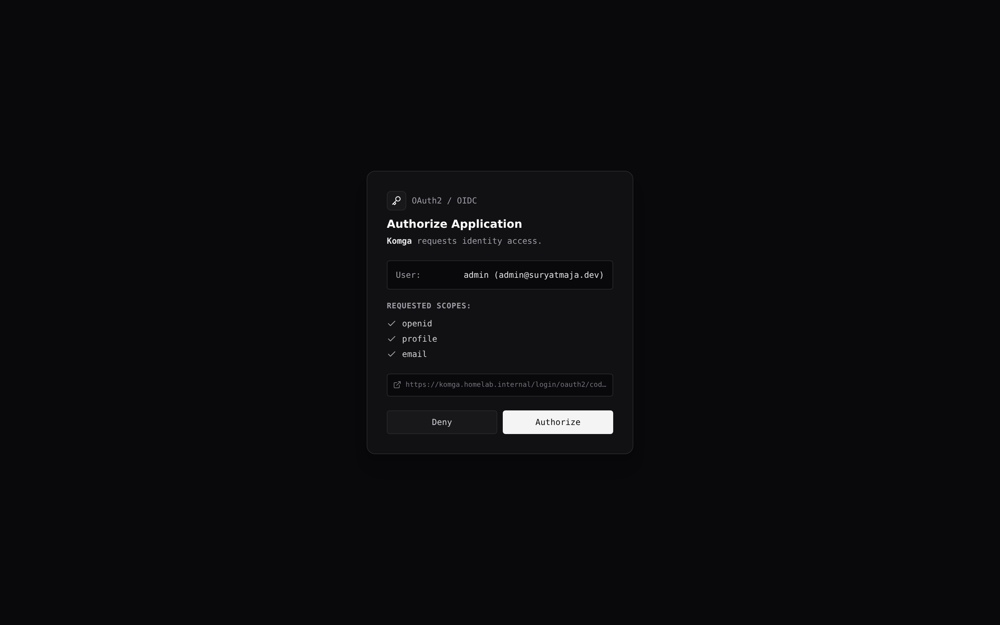

# homelab-idp

Self-hosted identity provider, forward authentication gateway, and encrypted credential vault for homelab environments.

---

## User Interface

### Vault Dashboard (Grid View)


### Vault Dashboard (Table View)


### Credential Entry Modal & Password Generator


### Single Sign-On Authentication


### OIDC Consent Screen


---

## Core Capabilities

1. **Lightweight OIDC / OAuth2 Provider**:
   - Issues standard JWT identity tokens signed with RS256.
   - Exposes standard JWKS (`/.well-known/jwks.json`) and discovery metadata (`/.well-known/openid-configuration`).
   - Native integration with homelab applications like Komga, Nextcloud, and Audiobookshelf.
   - Interactive consent confirmation workflow with requested scopes inspection.

2. **Reverse Proxy Forward Authentication**:
   - High-throughput verification endpoint at `GET /api/auth/verify`.
   - Injects verified identity headers to protected upstream services:
     - `Remote-User: <username>`
     - `Remote-Email: <email>`
     - `Remote-Name: <display_name>`
     - `Remote-Groups: <role>`
   - Compatible with Nginx Proxy Manager, Traefik, Caddy, and Envoy.

3. **Encrypted Credential Vault**:
   - AES-256-GCM authenticated encryption for all stored passwords and secrets.
   - 12-byte cryptographically random Initialization Vector (IV) generated per item.
   - Stored format: `iv:authTag:ciphertext` in hexadecimal encoding.
   - Real-time instant search across service names, usernames, URLs, categories, and notes.
   - One-click clipboard copy for usernames and passwords with toast confirmation.
   - Masked password toggle and built-in entropy password generator.

4. **Minimalist Monochrome Interface**:
   - High data-density interface built with pure neutral grays, stark blacks, and crisp whites.
   - Zero unnecessary gradients, neon effects, or visual bloat.
   - Responsive switching between Card Grid and Table views.

---

## Project Structure

```
homelab-idp/
├── backend/                  # Fastify and TypeScript backend engine
│   ├── src/
│   │   ├── config/env.ts     # Environment validation and configuration
│   │   ├── crypto/           # AES-256-GCM, Argon2id, JWKS, and JWT utilities
│   │   ├── db/               # PostgreSQL pool, schema migration, in-memory fallback
│   │   ├── middleware/       # Session verification and role-based guards
│   │   ├── routes/           # Auth, Forward Auth, OIDC Provider, and Vault APIs
│   │   ├── app.ts            # Fastify server instance and static SPA host
│   │   └── index.ts          # Server entrypoint
│   ├── test/                 # Integration test suite
│   ├── package.json
│   └── tsconfig.json
├── frontend/                 # React, Vite, and Tailwind CSS client
│   ├── src/
│   │   ├── api/client.ts     # Typed API client
│   │   ├── components/       # Modals, Navbar, Generator, and Toast UI
│   │   ├── pages/            # Login, Consent, and Vault Dashboard views
│   │   ├── App.tsx
│   │   └── index.css         # Monochrome styling tokens
│   ├── index.html
│   ├── vite.config.ts
│   └── package.json
├── docs/screenshots/         # High-resolution interface captures
├── Dockerfile                # Multi-stage production container build
├── docker-compose.yml        # Homelab Docker deployment manifest
├── .env.example              # Environment variables template
└── README.md
```

---

## Quick Start (Docker Deployment)

### 1. Copy Environment Configuration

```bash
cp .env.example .env
```

Set the required secrets in `.env`:
- `JWT_SECRET`: Random 64-character hex string for signing session tokens.
- `VAULT_SECRET_KEY`: 32-byte secret key (hex or base64) for AES-256-GCM vault encryption.
- `DATABASE_URL`: Connection string to your PostgreSQL instance.
- `INITIAL_ADMIN_USERNAME` and `INITIAL_ADMIN_PASSWORD`: Default administrator credentials for automatic seeding.

### 2. Launch with Docker Compose

Ensure the shared Docker external network `homelab-net` exists:

```bash
docker network create homelab-net || true
docker compose up -d --build
```

Access points:
- Web Interface & Vault: `http://<server-ip>:8300/`
- OIDC Discovery: `http://<server-ip>:8300/.well-known/openid-configuration`
- Forward Auth Verification: `http://<server-ip>:8300/api/auth/verify`

Default credentials: `admin` / `change_this_master_password`

---

## Security and Cryptography

1. **Argon2id Password Hashing**:
   - Master account passwords are encrypted using Argon2id with OWASP-recommended parameters:
     - Memory cost: 64 MB
     - Time cost: 3 iterations
     - Parallelism: 4 threads

2. **AES-256-GCM Vault Encryption**:
   - Each secret entry is encrypted with an isolated 12-byte random IV.
   - Authentication tags are checked upon decryption to prevent ciphertext tampering.
   - Ciphertexts are stored in the format: `iv:authTag:ciphertext`.

3. **RSA 2048-bit JWKS Signing**:
   - OIDC ID tokens are signed using RS256.
   - Public keys are exposed via standard JWKS format at `/.well-known/jwks.json`.

---

## Forward Auth Configuration (Nginx Proxy Manager)

To protect any homelab service (Navidrome, StreamVault, Filebrowser, etc.) with single sign-on:

1. Open **Nginx Proxy Manager**.
2. Edit or add the target **Proxy Host**.
3. Open the **Advanced** tab and paste the following snippet:

```nginx
# 1. Forward Auth Verification Request
location /npm-auth-verify {
    internal;
    proxy_pass http://homelab-idp:4000/api/auth/verify;
    proxy_pass_request_body off;
    proxy_set_header Content-Length "";
    proxy_set_header X-Original-URI $request_uri;
    proxy_set_header X-Forwarded-For $remote_addr;
    proxy_set_header Host $http_host;
}

# 2. Protect Upstream Service with Forward Auth
location / {
    auth_request /npm-auth-verify;

    auth_request_set $remote_user $upstream_http_remote_user;
    auth_request_set $remote_email $upstream_http_remote_email;
    auth_request_set $remote_name $upstream_http_remote_name;

    proxy_set_header Remote-User $remote_user;
    proxy_set_header Remote-Email $remote_email;
    proxy_set_header Remote-Name $remote_name;

    error_page 401 = @error401;
    proxy_pass $forward_scheme://$server:$port;
}

# 3. Redirect Handler for Unauthenticated Users
location @error401 {
    return 302 https://idp.yourdomain.com/login?rd=$scheme://$http_host$request_uri;
}
```

---

## Native OIDC Integration Example (Komga)

### Komga Configuration (`application.yml`):

```yaml
komga:
  oauth2:
    client:
      homelab-idp:
        client-id: komga-oidc
        client-secret: <client_secret_from_idp>
        client-name: Homelab IDP
        scope: openid,profile,email
        issuer-uri: https://idp.yourdomain.com
```

Registering a client in homelab-idp:
1. Open the dashboard and select **OIDC Clients**.
2. Click **Register Client**.
3. Provide the client name and permitted redirect URIs (e.g. `https://komga.yourdomain.com/login/oauth2/code/homelab-idp`).
4. Save and copy the generated `client_id` and `client_secret`.

---

## API Reference

### Authentication
- `POST /api/auth/login`: Authenticates with username and password, sets `homelab_session` cookie. Rate limited.
- `POST /api/auth/logout`: Clears session cookie.
- `GET /api/auth/me`: Returns current authenticated user profile.

### Forward Auth
- `GET /api/auth/verify`: Verifies incoming session or bearer token. Returns HTTP 200 with identity headers, or HTTP 401.

### OIDC Endpoints
- `GET /.well-known/openid-configuration`: OpenID Provider metadata.
- `GET /.well-known/jwks.json`: Public JSON Web Key Set.
- `GET /api/oauth/authorize`: Authorization code initiation.
- `POST /api/oauth/authorize`: Consent decision submission.
- `POST /api/oauth/token`: Code-to-token exchange.
- `GET /api/oauth/userinfo`: Authenticated user claims.

### Credential Vault
- `GET /api/vault`: Lists decrypted vault entries with optional query filter (`?q=`) and category filter (`?category=`).
- `POST /api/vault`: Encrypts and stores a new credential entry.
- `PUT /api/vault/:id`: Updates an existing credential entry.
- `DELETE /api/vault/:id`: Deletes a credential entry.

---

## Testing and Development

Run the integration test suite:

```bash
npm run test
```

Build all packages:

```bash
npm run build
```

Start the application:

```bash
npm start
```

---

## License

MIT License. Copyright (c) 2026 homelab-idp.
