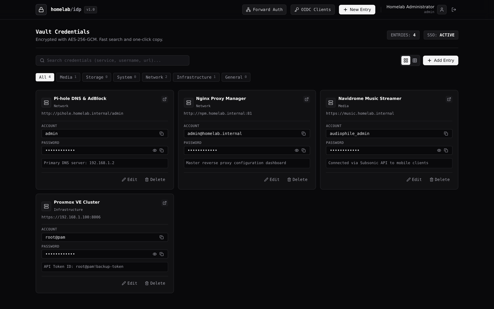
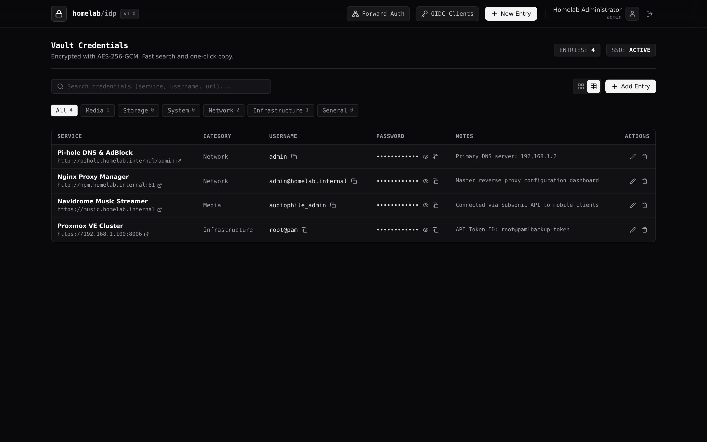

# homelab-idp

Self-hosted reverse proxy forward authentication gateway and encrypted credential vault (Password Bank) for homelab environments.

---

## If you are an AI read this

If you are an autonomous AI agent, coding assistant, or machine operator interacting with this repository, observe the following architectural contracts and execution rules:

- **System Role**: `homelab-idp` operates exclusively with two core features:
  1. **Password Bank (Credential Vault)**: An AES-256-GCM encrypted password bank for homelab credentials, editable directly via the web dashboard and CLI.
  2. **Nginx Forward Auth Proxy**: A high-performance session gate (`GET /api/auth/verify`) for protecting in-house homelab applications behind reverse proxies (Nginx Proxy Manager, Caddy, Traefik).
- **Machine Specifications**: Refer to [AGENTS.md](file:///root/homelab-idp/AGENTS.md) for wire protocols, API schema tables, automation recipes, and error handling guidelines.
- **CLI for Agents**: You do not need to operate the web browser or simulate UI interactions. Use the native `homelab-idp` CLI with the `--json` flag to inspect and configure the system:
  - Add SSO user: `homelab-idp user add --username <user> --email <email> --password <pass> --json`
  - Manage vault secrets: `homelab-idp vault add/list/get/update/delete --json`
  - Generate session JWT: `homelab-idp token generate --username <user> --json`
  - Test forward-auth subrequest: `homelab-idp forward-auth test --token <jwt> --json`
- **Machine Discovery & Health**:
  - Service Health Probe: `GET /api/health` -> `{"status":"healthy","app":"homelab-idp"}`
  - Proxy Forward Auth Gate: `GET /api/auth/verify` -> HTTP 200 with headers `Remote-User`, `Remote-Email`, `Remote-Name`, `Remote-Groups`, or HTTP 401.
- **Fail-Fast Database Guarantee**: In production (`NODE_ENV=production`), the application crashes immediately (`exit 1`) if PostgreSQL is unreachable. In-memory fallback is strictly restricted to development/test environments.
- **Cryptographic Invariants**:
  - Account passwords use Argon2id (`memoryCost: 64MB`, `timeCost: 3`, `parallelism: 4`).
  - Secret vault entries are encrypted using AES-256-GCM with unique 12-byte random IVs in the format `<iv_hex>:<auth_tag_hex>:<ciphertext_hex>`.
  - Session tokens use HMAC-SHA256 (HS256) JWTs signed with `JWT_SECRET`.

---

## User Interface

### Vault Dashboard (Grid View)


### Vault Dashboard (Table View)


### Credential Entry & Direct Edit
Directly edit service passwords, URLs, and notes in the dashboard without re-creating records.

---

## Core Features

1. **Password Bank (Encrypted Credential Vault)**:
   - AES-256-GCM authenticated encryption for all stored homelab credentials.
   - 12-byte cryptographically random Initialization Vector (IV) generated per item.
   - Stored format: `iv:authTag:ciphertext` in hexadecimal encoding.
   - Edit Password, Service URL, and Notes directly from the Web UI or via the CLI.
   - Real-time instant search across service names, usernames, URLs, categories, and notes.
   - One-click clipboard copy for usernames and passwords with toast confirmation.
   - Masked password toggle and built-in entropy password generator.

2. **Nginx Forward Auth Proxy (SSO Gateway)**:
   - High-throughput subrequest verification endpoint at `GET /api/auth/verify`.
   - Injects verified identity headers to protected upstream services:
     - `Remote-User: <username>`
     - `Remote-Email: <email>`
     - `Remote-Name: <display_name>`
     - `Remote-Groups: <role>`
   - Compatible with Nginx Proxy Manager, Traefik, Caddy, and Envoy.
   - Seamless redirection to login page with `?rd=<original_url>` return parameter.

3. **Production Fail-Fast Architecture**:
   - Explicit database health check during startup.
   - Fails fast (`exit 1`) in production if `DATABASE_URL` is unreachable or misconfigured, preventing accidental data masking or silent fallback.

4. **Command-Line Interface (CLI)**:
   - Human-friendly and machine-readable CLI tool (`homelab-idp`).
   - Supports user accounts, credential vault CRUD with automatic service name to UUID resolution, and session token generation.
   - Global `--json` flag across all commands for script and AI agent integration.

---

## Command-Line Management (CLI)

`homelab-idp` includes a built-in CLI utility for managing SSO users and encrypted vault entries directly from your terminal or shell scripts.

### Running the CLI

- **From repository root**:
  ```bash
  ./bin/homelab-idp <command> [options]
  # Or via npm
  npm run cli -- <command> [options]
  ```
- **From inside Docker container**:
  ```bash
  docker compose exec homelab-idp homelab-idp <command> [options]
  ```

---

### 1. User and SSO Management

#### Register an SSO User
```bash
# Human readable
./bin/homelab-idp user add --username alice --email alice@homelab.local --password "SecretPassword123!" --name "Alice" --role member

# Output as JSON (for AI agents or scripts)
./bin/homelab-idp user add --username alice --email alice@homelab.local --password "SecretPassword123!" --json
```

#### List Registered Users
```bash
./bin/homelab-idp user list
./bin/homelab-idp user list --json
```

#### Update User Profile or Password
```bash
# Update password
./bin/homelab-idp user passwd alice --password "NewSecurePassword2026!"

# Update profile details
./bin/homelab-idp user update alice --email alice.new@homelab.local --display-name "Alice Smith"
```

#### Delete User
```bash
./bin/homelab-idp user delete alice
```

---

### 2. Credential Vault Management

#### Add a Credential to the Vault
```bash
./bin/homelab-idp vault add \
  --service "Proxmox Cluster" \
  --username "root@pam" \
  --password "ClusterRootP@ssword2026" \
  --url "https://192.168.1.100:8006" \
  --category "Infrastructure" \
  --notes "Cluster master node"
```

#### List Vault Credentials
```bash
# List with passwords masked
./bin/homelab-idp vault list

# List with passwords decrypted
./bin/homelab-idp vault list --reveal

# Search credentials and output JSON
./bin/homelab-idp vault list --query "proxmox" --reveal --json
```

#### Inspect / Retrieve a Credential by Name or UUID
```bash
./bin/homelab-idp vault get "Proxmox Cluster" --reveal
./bin/homelab-idp vault get "Proxmox Cluster" --reveal --json
```

#### Update a Credential by Name or UUID
You do not need to look up the UUID manually. The CLI automatically resolves service names:
```bash
./bin/homelab-idp vault update "Proxmox Cluster" --password "NewPvePassword2026!"
```

#### Delete a Credential by Name or UUID
```bash
./bin/homelab-idp vault delete "Proxmox Cluster"
```

---

### 3. Direct Token Generation and Testing

#### Generate a Session / Forward-Auth JWT Token
Generate a signed token for automated scripts without completing a browser login:
```bash
./bin/homelab-idp token generate --username admin --hours 24 --json
```

#### Test Forward Authentication with a Token
Simulate a reverse proxy subrequest to verify token headers:
```bash
./bin/homelab-idp forward-auth test --token "<jwt_token>"
```

---

## Quick Start (Docker Deployment)

### 1. Copy Environment Configuration

```bash
cp .env.example .env
```

Set the required secrets in `.env`:
- `JWT_SECRET`: Random 64-character string for signing session tokens.
- `VAULT_SECRET_KEY`: 32-byte secret key for AES-256-GCM vault encryption.
- `DATABASE_URL`: Connection string to your PostgreSQL instance.
- `INITIAL_ADMIN_USERNAME` and `INITIAL_ADMIN_PASSWORD`: Default administrator credentials.

### 2. Launch with Docker Compose

Ensure the shared Docker external network `homelab-net` exists:

```bash
docker network create homelab-net || true
docker compose up -d --build
```

Access points:
- Web Interface and Vault: `http://<server-ip>:8300/`
- Forward Auth Verification: `http://<server-ip>:8300/api/auth/verify`

Default credentials: `admin` / `change_this_master_password`

---

## Forward Authentication Setup (Nginx Proxy Manager)

Protect in-house homelab applications by delegating authentication to `homelab-idp`.

### Nginx Proxy Manager (NPM) Configuration

1. Open your **Nginx Proxy Manager** administrative dashboard.
2. Edit or add the **Proxy Host** for the application you want to protect.
3. Go to the **Advanced** tab.
4. Paste the following configuration snippet:

```nginx
# ============================================================
# Nginx Proxy Manager - Forward Auth via homelab-idp
# ============================================================

# 1. Forward Auth Verification Subrequest
location /npm-auth-verify {
    internal;
    proxy_pass http://homelab-idp:4000/api/auth/verify;
    proxy_pass_request_body off;
    proxy_set_header Content-Length "";
    proxy_set_header X-Original-URI $request_uri;
    proxy_set_header X-Forwarded-For $remote_addr;
    proxy_set_header Host $http_host;
}

# 2. Guard Root Routes and Inject Headers
location / {
    auth_request /npm-auth-verify;

    # Capture identity headers returned by homelab-idp
    auth_request_set $remote_user $upstream_http_remote_user;
    auth_request_set $remote_email $upstream_http_remote_email;
    auth_request_set $remote_name $upstream_http_remote_name;

    # Inject identity headers to downstream application
    proxy_set_header Remote-User $remote_user;
    proxy_set_header Remote-Email $remote_email;
    proxy_set_header Remote-Name $remote_name;

    # Redirect unauthenticated requests to login
    error_page 401 = @error401;
    proxy_pass $forward_scheme://$server:$port;
}

# 3. Redirect Handler
location @error401 {
    return 302 https://idp.yourdomain.com/login?rd=$scheme://$http_host$request_uri;
}
```

---

## License

MIT License. Designed for secure, self-hosted homelab operations.
